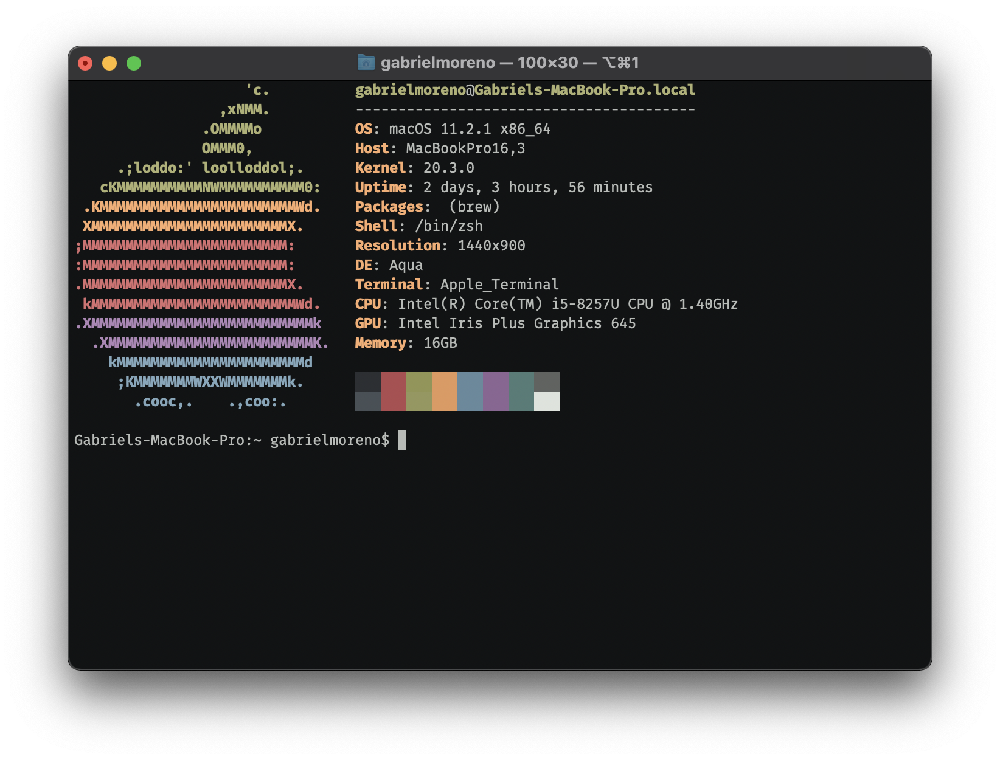

<h1 align="center">Macfetch</h1>

<p align="center">
  
</p>

<p align="center">
  
  
  
  
</p>

A macOS [Neofetch](https://github.com/dylanaraps/neofetch) alternative written in [C++](https://en.wikipedia.org/wiki/C++).

## But why?

_"Why? Why another Neofetch rewrite?"_ I hear you ask, and the answer is pretty simple. Yes, there are multiple Neofetch rewrites out there, most of them probably faster than Macfetch, but besides doing absolutely the same as Neofetch (but much faster), they all share something in common, **macOS is not supported**.

- [`paleofetch`](https://github.com/ss7m/paleofetch): only supports Arch (and it's no longer maintained).
- [`fastfetch`](https://github.com/LinusDierheimer/fastfetch): only supports some Linux distros.
- [`freshfetch`](https://github.com/K4rakara/freshfetch): same as the above.
- [`macchina`](https://github.com/Macchina-CLI/macchina): lacks the Neofetch aesthetic.

Yes, Linux is supported, and that's great, but it's about time for a macOS alternative to come out, and that's why Macfetch (as it name suggests) is **macOS-only**.

## Installation

To install Macfetch, build from source. Start by cloning the repo:

```sh
$ git clone https://github.com/gantoreno/macfetch.git
$ cd macfetch
```

Generate the `Makefile` with `cmake`:

```sh
$ cmake .
```

And compile with `make`:

```sh
$ make
```

A binary named `macfetch` should now be available under the `out` directory. Feel free to move it to any location, for example, `/usr/local/bin`:

```sh
$ mv out/macfetch /usr/local/bin
```

## Customization

Macfetch is 100% customizable in terms of segments, ascii arts and layout (as long as you know a little bit of C++).

### Segments

All segments are defined inside `main.cpp`, a segment is created by using the `segment` structure. A segment may (or may not) have a `name` property (which defaults to `""` if not provided), and a `descriptor`, which is a pointer function that runs the necessary commands in order to get the segment information. For example, let's imagine a "Foo" segment:

```cpp
vector<segment> segments = {
    // ...
    segment("Foo", foo),
    // ...
};
```

The Foo segment has a name of "Foo" and a descriptor function `foo`. But, how does this descriptor look and behave?

All available segment descriptors are declared inside `include/descriptors.hpp` and defined inside `src/descriptors.cpp`, a segment descriptor follows this rules:

- A `void*` return type.
- A `string& out` parameter.

For example:

```cpp
void* foo(string& out)
{
    out = "This is foo";

    return NULL;
}
```

See how the output of the segment descriptor gets assigned to `out` and not returned instead, this is because Macfetch takes advantage of C++'s threads. All segments create a thread inside the `segment_threads`, and they all redirect their outputs to their corresponding indexes from the `segment_outputs` array (both under `src/utils.cpp`, inside the `display` method). 

As mentioned, segments may also not have a defined name (which is the case for color blocks). For this case, you just declare a segment and only provide a descriptor:

```cpp
vector<segment> segments = {
    // ...
    segment(bar),
    // ...
};
```

This way, the segment will only display the output of the `bar` descriptor, without a name. You can also define an empty segment (useful for creating empty lines). It's as easy as declaring a segment without a name, and passing the built-in `empty` descriptor:

```cpp
vector<segment> segments = {
    // ...
    segment(empty),
    // ...
};
```

Pretty readable, right? Now you have everything you need to start customizing Macfetch as you want!

### Colors

All colors are macro-defined inside `include/colors.hpp`, feel free to look around and see how they're used througout the program.

### ASCII

See `include/ascii.hpp` & `src/ascii.cpp` to view & modify available ascii logos. Notice how the `ascii_darwin` has an all-spaces final row the same length as the previous rows, this is in order to use that row to align subsequent segments that overflow the logo height. Make sure to include a similar one whenever you add/modify a logo.

# License

Licensed under the [MIT](https://opensource.org/licenses/MIT) license.
